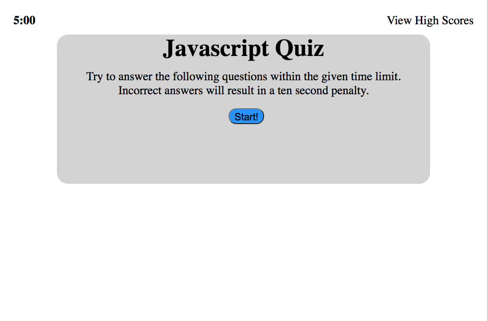
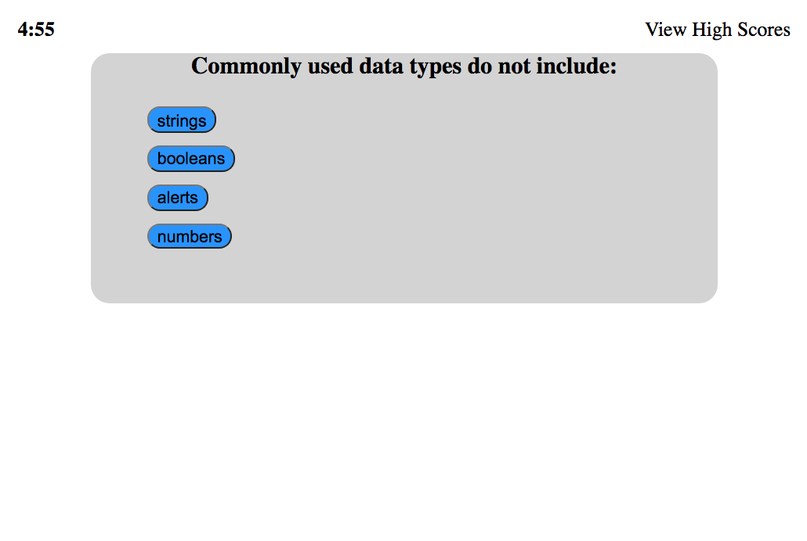
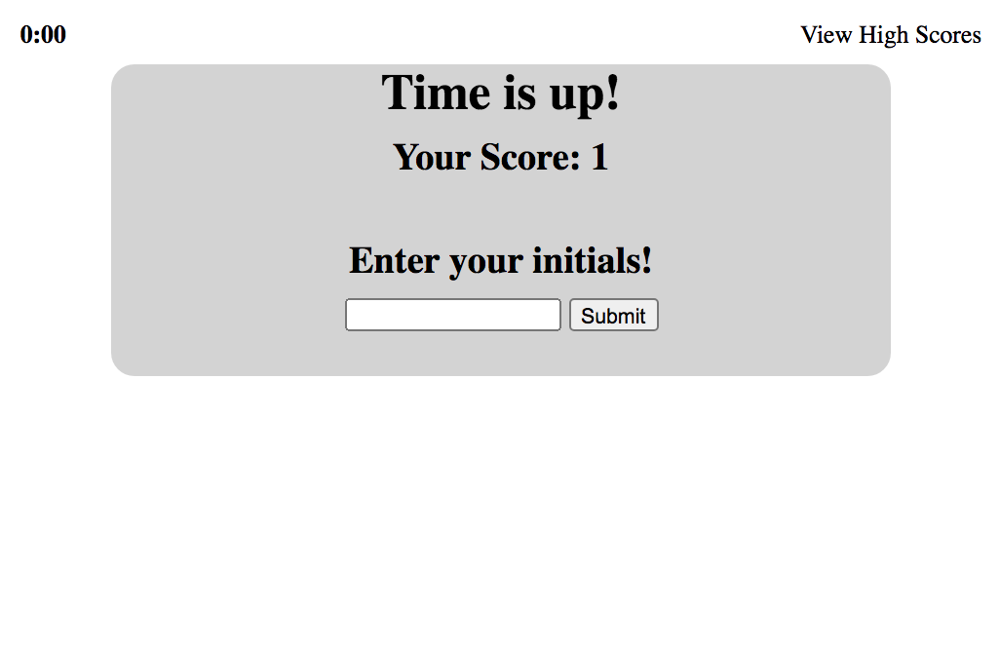
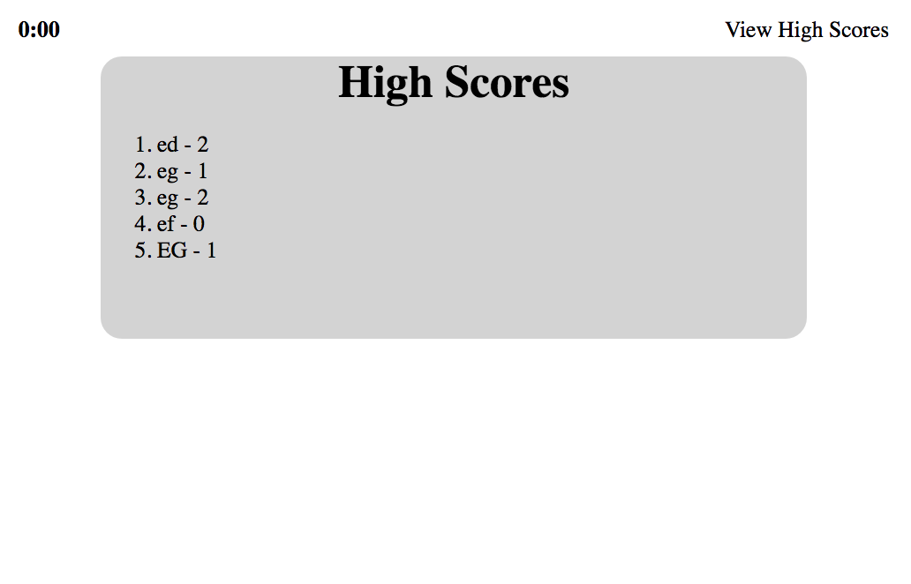

# javascript-quiz
## Introduction
A quiz to test a users knowlege in javascript and related coding questions. 

## How to Use
1. Click on the start button to begin quiz
2. Answer the questions to the best of your ability
3. Enter your initials at the end of the quiz if you wish to store your score.
* click on the high score button in the top right corner to view the stored scores.

## Design
Simple card layout. Start button begins the timer and begins to show the questions one by one. At the end of the questions or time, an option to add your score to a high score list is presented. Your initials and score are stored in local storage. 

## Files and Directory
* javascript-quiz
    * screenshots
        * start.png
        * question.png
        * initials.png
        * highscores.png
    * index.html
    * script.js
    * style.css
    * README.md

## Link
[Link to Live Website](https://jesusefraingonzalez.github.io/javascript-quiz)

## Screenshots

# todo
* fix high score button to work on all screens
* sort high scores to show the top scores
* make the site more aesthetically pleasing
* clean up the code
    * use variables for DOM elements when possible and useful
    * reorganize variables 
    * reorganize comments and code so they match up and make sense

